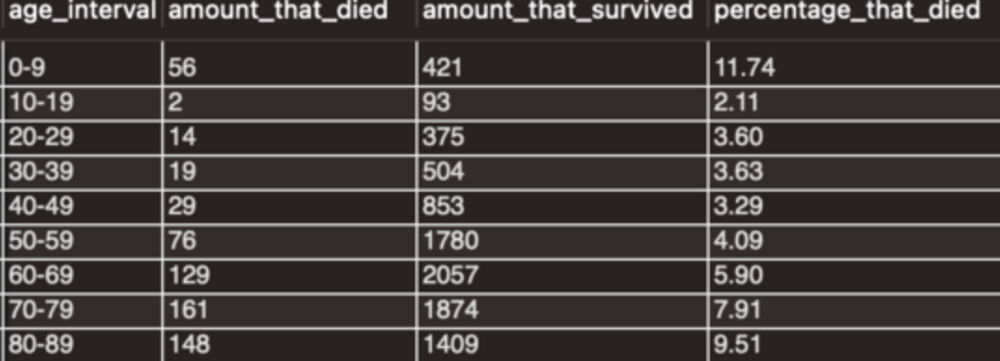
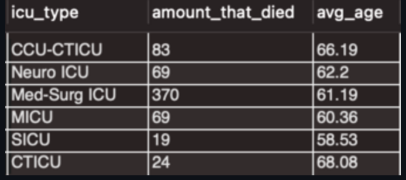

# SQL-project-1--Hospital-Mortality-Prediction
Hospital Mortality Prediction

Dataset used : https://www.kaggle.com/datasets/mitishaagarwal/patient?resource=download
(CSV file is also uploaded)

1: 

Out of the 10,000 admitted patients in the hospital, a total of 634 patients died, which translates to 6.34%.

2:

This output showed the amount of patients that died and survived in each age group, categorized by 10-year intervals. There were far more admitted patients between the ages of 50-89 compared to patients who were between 0-49. Observing the results more, we can see that patients between ages 0-9 had the highest death percentage and each 10-year age group in the 50-89 range had a slight increase in death percentage. Nearly 1 in every 6 patients between the ages of 70-89 died in the hospital.

3:

This output further proves that the death probability of a patient in the hospital rises as they get older.

4:

These two outputs give more insight to the outcomes of patients in each ICU admit source & type. A vast majority of the patients were admitted to the "Accident & Emergency" ICU admit source and it also experienced the highest number of deaths. However, the ICU admit source with the highest probability of death was "Floor" with a percentage of 11.76. "Other ICU" was ignored because of its very small sample size.

In the second output where death results are shown for each ICU type, there is a clear outlier: Med-Surg ICU

5:

Average weight, BMI, and max heart rate among the patients that died.

The average weight of 67.57 kg (149 in lbs) suggests that, on average, the patients who passed away had a relatively moderate weight. The average BMI of 23.3 indicates that, on average, the patients who died had a BMI within the normal range. This suggests that weight alone may not be the sole determinant of mortality, as individuals with a normal BMI can also face significant health risks and complications leading to hospital death. The average maximum heart rate of 115.1 highlights a potential cardiovascular aspect in the patients' health profiles. Elevated heart rates can be indicative of underlying conditions (source), such as cardiac distress or organ failure, which might have contributed to the hospital mortality outcomes observed.

6:

There were a total of 8 comorbidities in the dataset, and the 3 shown in the output results above (Diabetes, Immunosuppression, and Solid Tumor) had the highest probability of death with diabetes being the highest, by far.
7:

According to this output, a patient who stayed in the ICU for longer than a day had a higher chance of death compared to someone who spent less than a day in the ICU.

